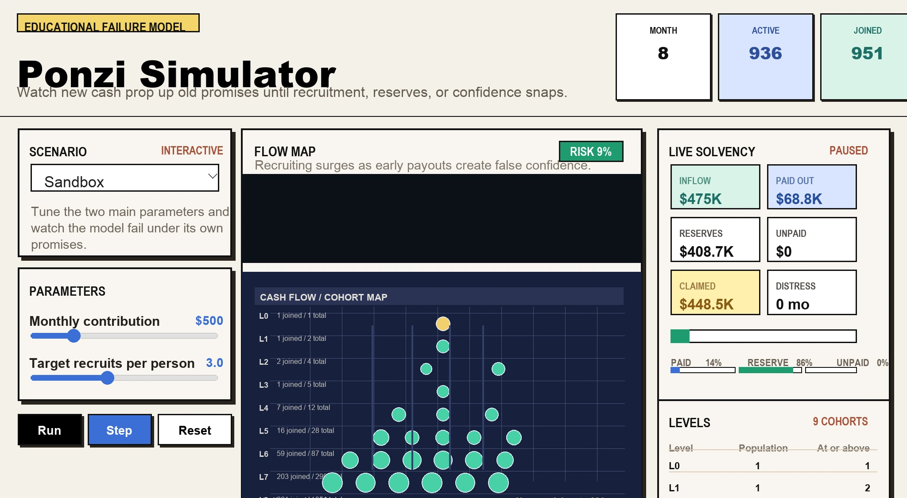

# Ponzi Simulator

Ponzi Simulator is an educational Vite + React + Tailwind CSS app with a Phaser-powered game canvas. It models how recruitment-driven fraud appears to work early, then collapses when new money cannot cover promised returns and withdrawals.

## Run

```bash
make up
```

Open `http://localhost:5173/ponzi_simulator/`.

## Commands

```bash
make up      # install dependencies if needed and start Vite
make kill    # stop the Vite dev server
make test    # run Vitest
make build   # build production assets
make deploy  # build and publish dist with gh-pages
```

## Gameplay

Use the Sandbox scenario to change the two main inputs:

- Monthly contribution
- Target recruits per person

The simulator advances month by month. It shows level populations, cumulative population at or above each level, reserves, unpaid liabilities, money paid out, and collapse risk.

Historical watch-only scenarios are included for Charles Ponzi, Bernard Madoff, and Allen Stanford. They are simplified educational approximations, not forensic reconstructions.

## Research Note

See [ponzi_scheme.md](./ponzi_scheme.md) for the background summary used to frame the model.
